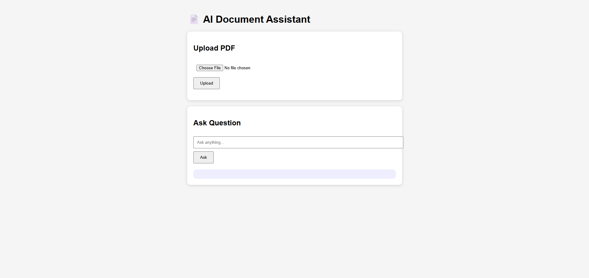
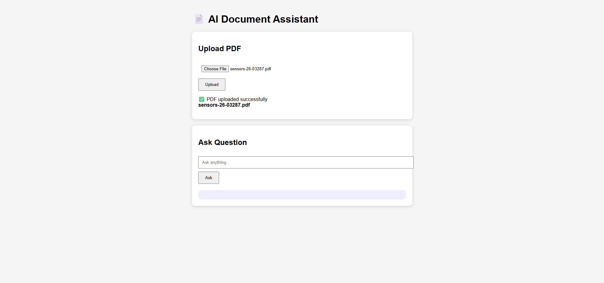

# 📄 AI Document Assistant (RAG Chatbot)

An AI-powered document question answering system built using **FastAPI**, **ChromaDB**, **Sentence Transformers**, and **Google Gemini API**.

---

## 🚀 Features

- Upload PDF documents
- Extract text automatically
- Semantic Search using Vector Embeddings
- Retrieval-Augmented Generation (RAG)
- AI-generated answers using Google Gemini
- FastAPI REST API
- Responsive HTML/CSS/JavaScript frontend

---

## 🛠 Tech Stack

- Python
- FastAPI
- ChromaDB
- Sentence Transformers
- Google Gemini API
- PyPDF
- HTML
- CSS
- JavaScript

---

## 📂 Project Structure

```text
backend/
    app.py
    chat.py
    upload.py
    rag.py
    gemini.py

frontend/
    index.html
    style.css
    script.js
```

---

## ⚙️ Installation

Clone the repository

```bash
git clone https://github.com/RajeshDev012/AI-Document-Assistant-RAG.git
```

Move into the project

```bash
cd AI-Document-Assistant-RAG/backend
```

Create virtual environment

```bash
python -m venv venv
```

Activate

Windows

```bash
venv\Scripts\activate
```

Install dependencies

```bash
pip install -r requirements.txt
```

Create a `.env`

```env
GEMINI_API_KEY=YOUR_API_KEY
```

Run

```bash
uvicorn app:app --reload
```

Open

```
http://127.0.0.1:8000
```

---

## 📷 Screenshots

### Home



### Upload PDF



### Chat

(Add Screenshot)

---

## 📖 Workflow

```text
Upload PDF
      │
      ▼
Extract Text
      │
      ▼
Split into Chunks
      │
      ▼
Generate Embeddings
      │
      ▼
Store in ChromaDB
      │
      ▼
Semantic Search
      │
      ▼
Gemini API
      │
      ▼
Answer to User
```

---

## 👨‍💻 Author

Rajesh Debnath

GitHub:
https://github.com/RajeshDev012